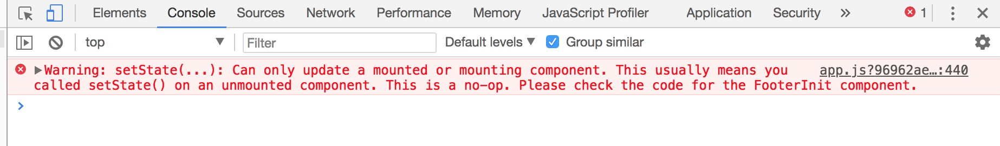
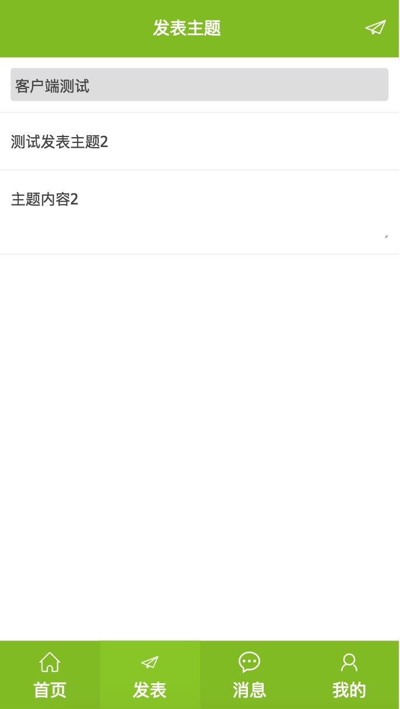

## react-cnode

## Note  
1. **webpack-dev-server搭建环境（开发／生产），proxy实现访问cnode社区的接口请求**      
[cnode-API](https://cnodejs.org/api)
2. **tab切换选中**   
头部和底部tab切换原来用的redux方式，因为用store控制选中状态当重新刷新页面,store就初始化了，后来改为router方式控制选项卡切换
3. **React router 4 does not update view on link, but does on refresh**    [https://stackoverflow.com/questions/43895805/react-router-4-does-not-update-view-on-link-but-does-on-refresh/44565602]
4. **react-router v4 使用 history 控制路由跳转**  
找不到history的时候试试withRouter吧~~  
https://github.com/brickspert/blog/issues/3
5. **Warning: Can only update a mounted or mounting component**

 

[React异步请求数据出现setState(...): Can only update a mounted or mounting component...](https://www.jianshu.com/p/a9d1f5aa719a )  

[这个错误是什么问题呢This usually means you called setState() on an unmounted component](http://react-china.org/t/this-usually-means-you-called-setstate-on-an-unmounted-component/7397/12)  

[isMounted is an Antipattern
](https://doc.react-china.org/blog/2015/12/16/ismounted-antipattern.html)

6. **发表主题部分**  

用state传来传去有点麻烦，用的redux，也刚好练习练习redux；但是redux貌似都是存状态（网页的dark和light模式等等），可能不太恰当吧；先不改了；

