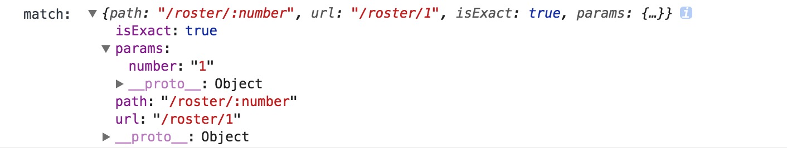

# 简介
BrowserRouter demo,用create-react-app构建应用，使用React-router4.

## 目的
练习React-router4

## 项目运行
- npm install
- npm start

## 知识点
1. Link

主要api是to，to可以接受string或者一个object，来控制url。使用方法如下
```js
 <Link to='/'>Home</Link>
```
2. Switch

Switch常常会用来包裹Route，它里面不能放其他元素，用来只显示一个路由。
```js
<Switch>
    <Route exact path='/' component={Home} />
    <Route path='/roster' component={Roster} />
    <Route path='/schedule' component={Schedule} />
</Switch>
```
3. Route

Route是路由的一个原材料，它是控制路径对应显示的组件，我们经常用的是exact、path以及component属性。  
- exact: 控制匹配到/路径时不会再继续向下匹配
- path: 标识路由的路径
- component: 表示路径对应显示的组件
```js
<Switch>
    <Route exact path='/' component={Home} />
    <Route path='/roster' component={Roster} />
    <Route path='/schedule' component={Schedule} />
</Switch>
```
4. match

match是在使用router之后被放入props中的一个属性，在class创建的组件中我们需要通过this.props.match来获取match之中的信息。match中包含的信息如下。
  



## 参考链接
1. [A Simple React Router v4 Tutorial](https://medium.com/@pshrmn/a-simple-react-router-v4-tutorial-7f23ff27adf)
2. [HashRouter](https://codepen.io/pshrmn/pen/YZXZqM)  
3. [BrowserRouter](https://codesandbox.io/s/vVoQVk78)
4. [React-router4简约教程](http://react-china.org/t/react-router4/15843)